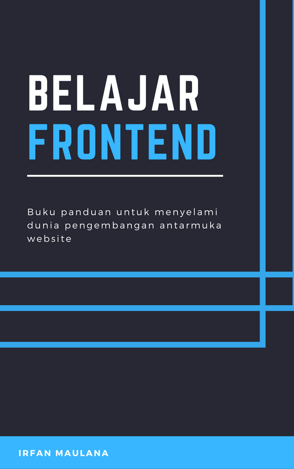

# 📚 Ebook Belajar Frontend

Buku panduan untuk menyelami dunia pengembangan antarmuka website

## Sampul

## Unduh PDF

N/A

## Daftar Isi (WIP)

- Tingkat Dasar
  - Bahan Baku Web
  - Persiapan Lingkungan Kerja
	- Belajar HTML
	  - Mengenal HTML
		- Struktur HTML
		- Heading dan Teks
		  - Heading
			- Paragraf
			- Teks
			- Cetak Tebal dan Miring
			- Penekanan
			- Hyperlink atau Tautan
			  - Alamat pada tautan
				- Membuka tautan pada tab baru
				- Membuat tautan dengan elemen
		- Blok Kontainer
		- Tabel
		  - Dasar-dasar Tabel
		  - Kolom dan Baris
			- Penggabungan Kolom atau Baris
		- Daftar
			- Daftar Berurut
			- Daftar Tidak Berurut
			- Daftar Bersarang
		- Form
		- Media
	- Belajar CSS
	- Belajar JavaScript

## Credits

N/A

---

Copyright © 2019-2020 oleh Irfan Maulana
